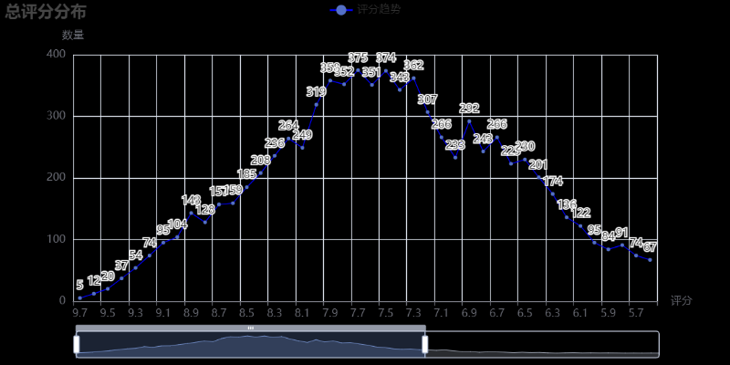

# 一个兴趣使然的项目

## 本项目采用python selenium库模拟浏览器操作进行数据获取 

### 本项目使用使用chrome v124 如果是其他chrome版本请下载对应版本驱动

https://sites.google.com/chromium.org/driver/home

```python
# 程序入口main.py 跳转src中index文件
# 使用三个函数进行数据获取
# exhaustive_ID() 根据豆瓣movie_ID进行穷举 找出真实ID 此时index表status状态字段为0
# get_personnel() 获取电影演职员 此时index表status状态字段为1
# get_long_comment() 获取电影长评 此时index表status状态字段为2
class Index:

    def __init__(self):
        self.conf = ReadConf()

    @staticmethod
    def index():
        exhaustive_ID()
        get_personnel()
        get_long_comment()
```

## 本项目使用品易IP代理池 也可通过配置文件配置项进行设置

```python
# True为使用代理 False为关闭代理
[proxy]
proxy = True

```

## 数据分析部分 分为7个维度进行分析

### 总评分分布

### 

### 电影类型统计


### 评论分析

```python
# 需要填写一个index表中状态为3的movie_ID
movie_ID = 1863766
```

#### **评分占比**


#### 评论走势


#### 好评标签云图


#### 作品拍摄国家热点图 


